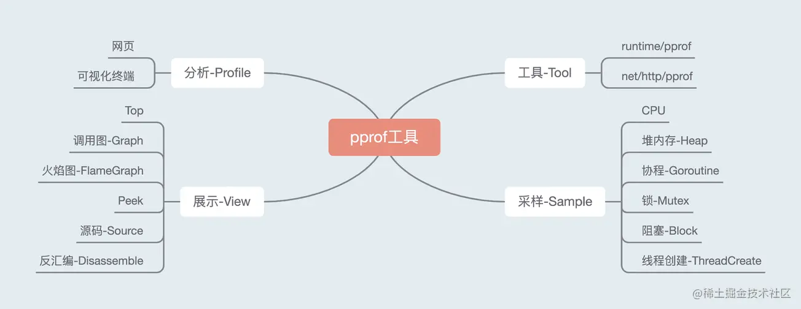

### 课前准备

克隆 [go-pprof-practice](https://github.com/wolfogre/go-pprof-practice) 并保证能够编译运行。

尝试使用 [test](https://go.dev/doc/tutorial/add-a-test) 命令，编写并运行简单测试

尝试使用 [-bench](https://pkg.go.dev/testing#hdr-Benchmarks) 参数，对编写的函数进行性能测试

### 高质量编程

#### 简介

- 正确可靠，简洁清晰
- 边界条件考虑完备
- 异常情况处理
- 易读易维护

编程原则：简单性、可读性、生产力

#### 常见编码规范

- 代码格式：使用 gofmt 自动格式化代码、使用 goimports 还可以同时配置依赖

- 注释：解释代码作用，实现过程、实现原因、代码在什么时候会出错、公共符号始终要注释

- 命名规范：简介胜于冗余、驼峰法命名

- 控制流程：避免嵌套

- 错误与异常处理：error.New()创建匿名变量表示简单错误、 fmt.Errorf() 满足格式化要求。 Wrap 和 Unwrap （在 fmt.Errorf 中使用 %w 来将一个错误 wrap 至其错误链中） 、尽量使用 error 代替 panic （recover），尽量只在 init 和 main 中使用。

#### 性能优化建议

- Benchmark 

```go
// fib.go
package fib

func Fib(n int) int {
	ans := []int{}
	for i := 0; i <= n; i++ {
		if i < 2 {
			ans = append(ans, i)
		} else {
			ans = append(ans, ans[i-1]+ans[i-2])
		}
	}
	return ans[n]
}

// fib_test.go
package fib

import "testing"

func BenchmarkFib(b *testing.B) {
	for i := 0; i < b.N; i++ {
		Fib(20)
	}
}
```

然后我们执行命令，其实正确写完程序后 IDE 应该会显示 test 的按钮：

```go
go test -bench=. -benchmem
```

然后我们就可以看到结果，

```shell
fib ❯ go test -bench=. -benchmem
goos: linux
goarch: amd64
pkg: fib
cpu: Intel(R) Core(TM) i7-10710U CPU @ 1.10GHz
BenchmarkFib-12       1514649         771.6 ns/op        504 B/op          6 allocs/op
PASS
ok      fib     1.982s
```

注意我们需要的那一行，第一项是函数名 + GOMAXPROCS（默认为 CPU 核数）；第二项是 b.N 的值；第三项是每次执行申请的内存；第四项是每次执行申请的分配次数（从 0 到 1 到 2 到 4 到 8 到 16 到 32）。

- Slice

  - 预分配内存，`make([]int, 0, size)` 可以避免多次扩容
  -  避免大内存未释放，比如我们取一个大切片的两个元素。`result = origin[:2]` ，那么我们推荐使用 `copy`。

-  Map

  - 预分配

- 字符串处理

- ```go
  func Plus(str string, n int) string {
  	s := ""
  	for i := 0; i < n; i++ {
  		s += str
  	}
  	return s
  }
  
  func StrBuilder(str string, n int) string {
  	var build strings.Builder
  	for i := 0; i < n; i++ {
  		build.WriteString(str)
  	}
  	return build.String()
  }
  
  func ByteBuffer(str string, n int) string {
  	buf := new(bytes.Buffer)
  	for i := 0; i < n; i++ {
  		buf.WriteString(str)
  	}
  	return buf.String()
  }
  
  // 我们使用上面学到的性能分析工具，可以看到
  // BenchmarkPlus-12           991     1109423 ns/op     2684243 B/op        999 allocs/op
  // BenchmarkStrbuilder-12     84500   12776 ns/op       17912 B/op          13 allocs/op
  // BenchmarkByteBuffer-12     45380   26939 ns/op       24240 B/op          9 allocs/op
  ```

  - 使用 strings.Builder 性能最好，使用 + 性能最差，也能使用预分配。
  - 当使用 + 拼接 2 个字符串时，生成一个新的字符串，那么就需要开辟一段新的空间，新空间的大小是原来两个字符串的大小之和。
  - strings.Builder，bytes.Buffer 的内存是以倍数申请的
  - strings.Builder 和 bytes.Buffer 底层都是 []byte 数组，bytes.Buffer 转化为字符串时重新申请了一块空间，存放生成的字符串变量，而 strings.Builder 直接将底层的 []byte 转换成了字符串类型返回

- 空结构体

  - 我们这样就可以使用 map 来实现 set 了， value 设置为空结构体就好了，节省内存

- atomic 包

  - 效率比锁要高，因为锁属于系统调用，atomic 是硬件实现
  - sync.Mutex 应该用来保护一段逻辑而不是一个变量
  - 对于非数值，可以使用 `atomic.Value` 能承载一个 `interface{}`

### 性能调优实战

#### 原则

- 依靠数据不是猜测
- 定位最大瓶颈
- 不要过早优化
- 不要过度优化

#### 性能分析工具 pprof



#### 排查实战

首先我们将程序运行起来，然后在浏览器访问这个网址 http://localhost:6060/debug/pprof/ 就能看到可视化的分析界面。

 当然，我们也可以使用下面这个命令行，

```shell
go tool pprof http://localhost:6060/debug/pprof/profile
```

执行命令之后，我们输入 top 查看占用情况，

```shell
(pprof) top
Showing nodes accounting for 6.99s, 99.71% of 7.01s total
Dropped 1 node (cum <= 0.04s)
      flat  flat%   sum%        cum   cum%
     6.99s 99.71% 99.71%      7.01s   100%  github.com/wolfogre/go-pprof-practice/animal/felidae/tiger.(*Tiger).Eat
         0     0% 99.71%      7.01s   100%  github.com/wolfogre/go-pprof-practice/animal/felidae/tiger.(*Tiger).Live
         0     0% 99.71%      7.01s   100%  main.main
         0     0% 99.71%      7.01s   100%  runtime.main
```

从左到右分别是当前函数的占用，flat 占总量的比例，上面所有行的 flat% 总和，当前函数加上其调用函数的总占用，cum 占总量的比例。

flat == cum 说明函数中没有调用其他函数，flat == 0 说明函数中只用其他函数的调用。

我们输入 list Eat ，就可以查看这个函数，并且给出每一行的占用，

```shell
(pprof) list Eat
Total: 7.01s
ROUTINE ======================== github.com/wolfogre/go-pprof-practice/animal/felidae/tiger.(*Tiger).Eat in /home/pikachu/CodeField/Code_Go/go-pprof-practice/animal/felidae/tiger/tiger.go
     6.99s      7.01s (flat, cum)   100% of Total
         .          .     19:}
         .          .     20:
         .          .     21:func (t *Tiger) Eat() {
         .          .     22:   log.Println(t.Name(), "eat")
         .          .     23:   loop := 10000000000
     6.99s      7.01s     24:   for i := 0; i < loop; i++ {
         .          .     25:           // do nothing
         .          .     26:   }
         .          .     27:}
```

然后我们输入 web ，需要安装 `graphviz` (使用命令：sudo apt install graphviz)，然后我们就能直观的在浏览器中看到哪个函数的 CPU 占用最大。排查掉这个问题之后，我们继续。

重新启动程序，执行下面这个命令来分析内存占用，

```shell
go tool pprof http://localhost:6060/debug/pprof/heap
```

继续使用 top 命令，list Steal 查看，也可以使用 web 查看图形化界面，

```shell
(pprof) list Steal
Total: 1.31GB
ROUTINE ======================== github.com/wolfogre/go-pprof-practice/animal/muridae/mouse.(*Mouse).Steal in /home/pikachu/CodeField/Code_Go/go-pprof-practice/animal/muridae/mouse/mouse.go
    1.31GB     1.31GB (flat, cum) 99.89% of Total
         .          .     45:
         .          .     46:func (m *Mouse) Steal() {
         .          .     47:   log.Println(m.Name(), "steal")
         .          .     48:   max := constant.Gi
         .          .     49:   for len(m.buffer) * constant.Mi < max {
    1.31GB     1.31GB     50:           m.buffer = append(m.buffer, [constant.Mi]byte{})
         .          .     51:   }
         .          .     52:}
```

找到问题，那么就解决问题，（最简单粗暴的方法就是注释掉）。

接下来就是使用相同的方法来排查问题了，可以去看看作者的博客。

### 采样过程和原理  

- CPU：操作系统定时向进程发送信号，进程接收信号后记录当前堆栈，定时写入到输出流。
- 堆内存：采样程序通过内存分配器在堆上分配释放内存，记录大小和数量

