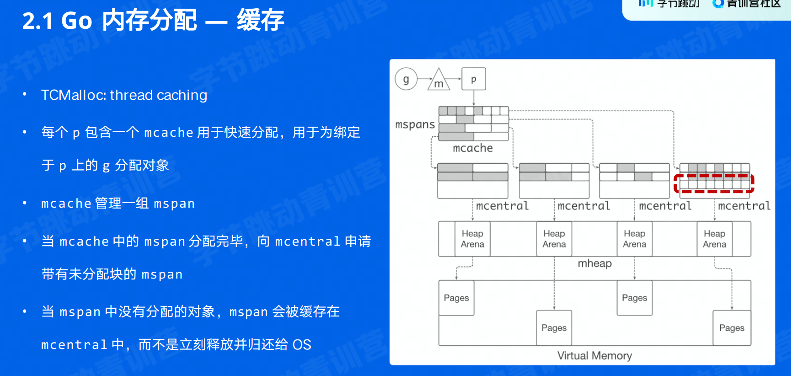

### 性能优化的层面

- 业务代码
- SDK
- 基础库
- 语言运行时
- OS

业务层优化容易针对特定场景，获得较大收益

语言运行时优化主要是解决更通用的性能问题

### 自动内存管理(GC)

- 动态内存：程序运行是动态分配的内存，如 malloc
- 自动内存管理（垃圾回收）：
  - 避免手动内存管理
  - 正确性和安全性，避免 double-free、use-after-free
- 三个任务
  - 为新对象分配空间
  - 找到存活对象
  - 回收死亡对象的内存空间
- 相关概念
  - Mutator 业务线程，分配新对象修改对象指向关系
  - Collector GC线程，找到存活线程，回收死亡对象的内存空间
  - Serial GC 只用一个 Collector
  - Parallel GC 支持多个 collector 同时回收
  - Concurrent GC：业务线程和 GC 线程可以同时执行
    - 必须感知对象指向关系的改变（以标记对象指向的对象必须被标记）
- 评价 GC 算法的指标
  - 安全性
  - 吞吐率（花在 GC 上的时间）
  - 暂停时间（业务是否感知）
  - 内存开销（GC 元数据开销）

#### 追踪垃圾回收 Tracing garbage collection

- 对象被回收的条件：指向关系不可达的对象
- 标记根对象（静态变量、全局变量等）
- 标记：找到可达对象（从根对象出发，找到所有可到达的对象）
- 清理：所有不可达区域
  - 将存活对象复制到另外的内存空间（Coping GC）
  - 将死亡对象的内存标记为可写（Mark-sweep GC），使用 free-list 来管理
  - 移动并整理存活对象（Mark-compact GC）原地整理

#### 分代 GC

对于年轻和年老的对象，制定不同的 GC 策略，降低整体内存管理的开销。

- 年轻代
  - 常规的对象分配
  - 存活对象少（Coping GC）
  - GC 吞吐率高
- 老年代
  - 对象趋于一直活着，反复复制开销大
  - 采用 Mark-sweep collection

#### 引用计数

- 每个对象都有一个与之关联的引用数目
- 优点是内存管理都被平摊到了程序执行过程中
- 缺点
  - 维护引用计数的开销较大，通过原子操作保证原子性
  - 无法回收环形数据结构比如 a 引用 b ，b 引用 a ，其实都可以回收了，但是引用数不为 0 
  - 内存开销，额外的引用数
  - 尽管平摊，依然可能引发暂停，比如树的根节点引用变成 0 ，那么需要把所有节点引用都设为 0

### Go 内存管理及优化

#### 分块

为对象在 heap 上分配内存，将内存分成大块，称为 mspan ，再将大块分成小块，用于对象分配。

- noscan mspan：分配不包含指针的对象，不需要 GC 扫描
- scan mspan：包含指针的对象

#### Banlanced GC

因为对象分配是非常高频的操作，并且小对象占比较高且 Go 内存分配路径较长。

我们就可以思考如下的优化策略：

- 每个 g 都绑定一大块内存，称为 goruntine allocation buffer (GAB)
- GAB 用于 noscan类型的小对象分配 < 1228B
- 使用 base、end、top 三个指针维护
- 指针碰撞风格对象分配

本质上就是将多个小对象的分配合并成为一次大对象的分配。

当 GAB 总大小超过一定阈值时，将 GAB 中存活的对象复制到另外分配的 GAB 中，释放原本的 GAB 。（coping GC）

### 编译器和静态分析

- 静态分析：不执行程序代码，推导程序行为
- 控制流：程序执行的流程
- 数据流：数据在控制流上的传递

- 过程内分析：仅在函数内部分析
- 过程间分析：考虑函数调用参数传递和返回值的数据流和控制流

### Go 编译器优化

#### 函数内联

- 减少函数调用开销
- 将过程间分析转化为过程内分析

- 函数体变大，编译生成 Go 镜像变大

#### Beast Mode

- Go 函数内联限制较多
- Beast Mode 调整函数内联策略，增加内联
  - 降低了函数调用开销
  - 增加了其他优化的几乎：逃逸分析（内联之后，逃逸大大减少）

